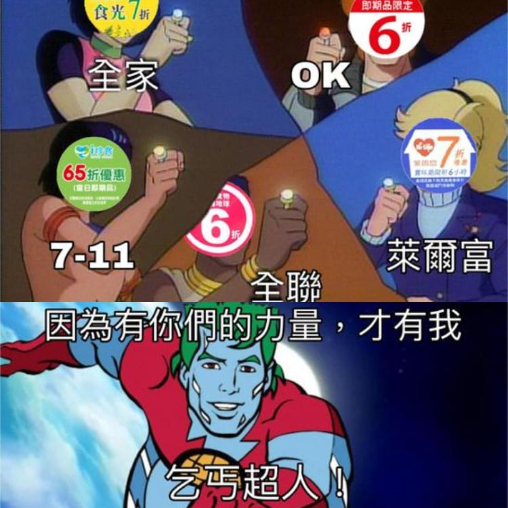

# The Overload Of Beggars 乞丐超人

提供在台灣生活的小資族整合過的各種省錢資訊，
像是：7-11 i珍食 + 全家友善時光。

## Contributing

請聯繫 @kayac-chang

- [email](mailto:egg734631+toob@gmail.com)
- [discord](discordapp.com/users/487655664416587777)

## Contributors

<!-- readme: collaborators,contributors -start -->
<table>
	<tbody>
		<tr>
            <td align="center">
                <a href="https://github.com/kayac-chang">
                    
                     
                    <b>Kayac Hello</b>
                </a>
            </td>
            <td align="center">
                <a href="https://github.com/FlandreDaisuki">
                    
                     
                    <b>Chun-Hao Lien</b>
                </a>
            </td>
            <td align="center">
                <a href="https://github.com/vn7n24fzkq">
                    
                     
                    <b>Casper</b>
                </a>
            </td>
            <td align="center">
                <a href="https://github.com/JohnsonMao">
                    
                     
                    <b>Johnson Mao</b>
                </a>
            </td>
		</tr>
	<tbody>
</table>
<!-- readme: collaborators,contributors -end -->

## License

See the [LICENSE](./LICENSE) file for details.
